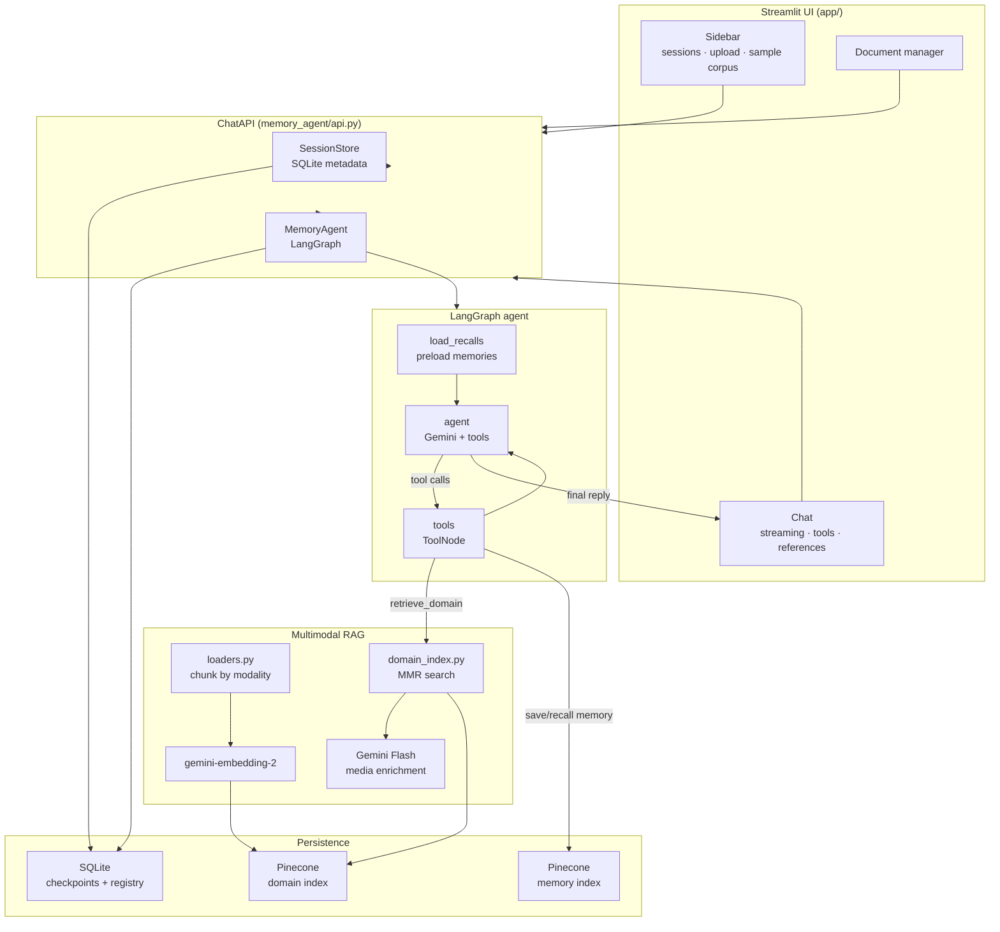
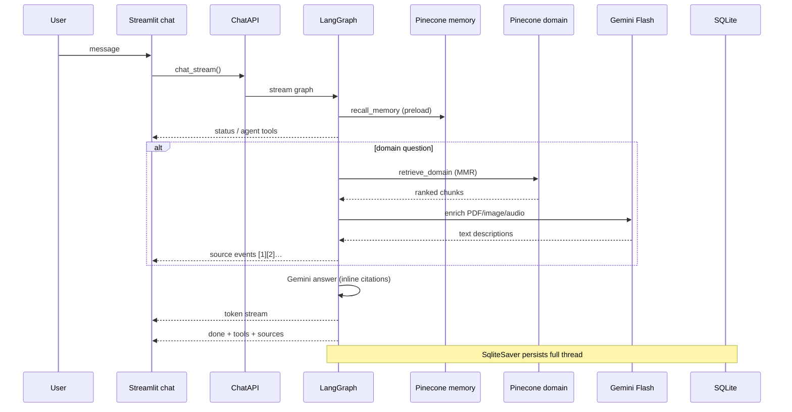

# Architecture

Memory Agent Chat separates the Streamlit UI from a LangGraph agent core with multimodal RAG and checkpointed sessions.

## System overview

## Request lifecycle (one chat turn)

## Module map

| Layer | Path | Role |
|-------|------|------|
| Entry | `app/main.py` | Page config, bootstrap, auto-index sample corpus |
| UI | `app/ui/chat.py` | Streaming chat, empty state, citation panels |
| UI | `app/ui/sidebar.py` | Sessions, upload, **Index sample corpus** |
| Facade | `memory_agent/api.py` | Sessions, history, ingest, streaming |
| Agent | `memory_agent/agent/graph.py` | LangGraph nodes, stream events, citations |
| Tools | `memory_agent/agent/tools.py` | `save_memory`, `recall_memory`, `retrieve_domain` |
| RAG | `memory_agent/rag/pipeline.py` | Ingest + retrieval constants |
| RAG | `memory_agent/rag/loaders.py` | Multimodal chunking |
| Vector | `memory_agent/vectorstore/domain_index.py` | Pinecone upsert + MMR |
| Demo | `memory_agent/demo/corpus.py` | Bundled `sample_data/` indexing |
| Demo | `scripts/index_sample_corpus.py` | CLI corpus loader |

## Tech decisions

| Choice | Why |
|--------|-----|
| **LangGraph** | Checkpointed multi-session threads, explicit tool routing, stream modes |
| **Gemini Embedding 2** | Single embedding space for text, PDF, image, audio, video |
| **MMR (`lambda=0.65`)** | Diverse context vs pure top-k — reduces redundant chunks |
| **Two Pinecone indexes** | Domain knowledge vs session-scoped memory with different filters |
| **SQLite checkpoints** | Durable conversation state without a separate DB for demos |
| **Streamlit** | Fast portfolio UI; core logic stays in `memory_agent/` for future FastAPI |

## Sample corpus & live demo

Bundled files live in `sample_data/`. For public demos:

1. Deploy to Streamlit Cloud (`app/main.py`)
2. Set secrets (see [DEPLOY.md](./DEPLOY.md))
3. Enable `AUTO_INDEX_SAMPLE_CORPUS=true` so first visitors get a pre-loaded knowledge base

See also [PORTFOLIO_ROADMAP.md](./PORTFOLIO_ROADMAP.md) for planned enhancements.
